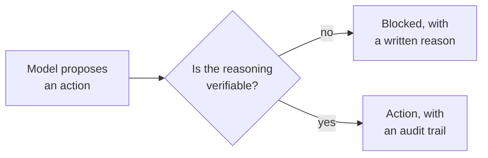

<h1 align="center">Cagri Temel</h1>

<p align="center">
  <strong>I build AI whose reasoning you can audit.</strong><br>
  Co-Founder &amp; CTO @ Vardenus · IEEE Senior Member (CIS) · AAAI Member · US &amp; TR patent holder · Redmond, WA
</p>

<p align="center">
  <a href="https://cagritemel.com"><b>cagritemel.com</b></a> ·
  <a href="https://orcid.org/0009-0003-3359-6939">ORCID</a> ·
  <a href="https://linkedin.com/in/cagritemel">LinkedIn</a> ·
  <a href="https://medium.com/@cagritemel">Medium</a> ·
  <a href="https://cagritemel.com/contact.html">Contact</a>
</p>

---

A model that explains itself is not the same as a model you can trust. The explanation has to be **load-bearing** — checkable *before* the action happens, not narrated afterward to make the output feel reasonable.



Same question in three places: in robots (**CT-SAFR**), in LLM applications (**ReasonGate**), and inside the model itself (**neural-trees**).

## Building

**[neural-trees](https://github.com/cgrtml/neural-trees)** — `pip install neural-trees`
Soft Decision Trees and Hierarchical Mixture-of-Experts in PyTorch, sklearn-compatible. Neural-network accuracy with a decision path a domain expert can read. Ships with 5×2cv F-tests, so "better than the baseline" means *statistically* better, not luckier on one split.

**[reasongate](https://github.com/cgrtml/reasongate)** — explainable security gate for LLM apps
Blocks prompt injection and returns a written reason for every decision. A confidence score of 0.87 is not something you can defend in an incident review; a cited rule and a matched span is.

**[ml-playground](https://github.com/cgrtml/ml-playground)** — sklearn · XGBoost · LightGBM · CatBoost · TabNet · neural-trees, compared side by side with significance testing built in, because most model comparisons you read are noise.

**[turbofan-explainable-neural-trees](https://github.com/cgrtml/turbofan-explainable-neural-trees)** — explainable remaining-useful-life prediction on NASA CMAPSS. Reference code for the IEEE SMC 2026 paper.

**[AI365](https://github.com/cgrtml/AI365)** — daily AI/ML/LLM/robotics builds, open and community-driven.

## Research

<details open>
<summary><b>Papers</b> — three IEEE conferences and a Q1 journal, 2026</summary>
<br>

**CT-SAFR: Safe and Interpretable Chain-of-Thought Reasoning for Autonomous Robots**
IEEE Conference on Artificial Intelligence (CAI 2026), Granada · *presented* · [PDF](https://cagritemel.com/assets/papers/CT-SAFR-CAI2026.pdf)
Four verification layers — structural, physical, semantic, interpretability — sitting between the model's reasoning and the actuator. 94.2% detection of unsafe or hallucinated reasoning at sub-500 ms latency, and 87% fewer unsafe outputs in a warehouse-robot case study.

**Towards Trustworthy Autonomous Robots: An Explainable AI-Based Decision Framework**
IEEE SoutheastCon 2026 · *accepted* · session chaired · [PDF](https://cagritemel.com/assets/papers/TRACE-Trustworthy-Autonomous-Robots-SoutheastCon2026.pdf)
TRACE — a model-agnostic four-layer architecture that traces every autonomous action back to the sensor evidence that caused it. Built against what EU AI Act and ISO 13482 auditability will actually demand.

**Explainable Neural Trees for RUL Prediction**
IEEE International Conference on Systems, Man, and Cybernetics (SMC 2026) · *accepted* · [code](https://github.com/cgrtml/turbofan-explainable-neural-trees)

**Domain-Specific vs General-Purpose Large Language Models in Orthodontics**
*Dentistry Journal* (MDPI) · Q1 · IF 3.1 · PubMed-indexed · *accepted*
Blinded comparison of a domain-tuned model against GPT-4o, Gemini, and Llama. The interesting result isn't which model won — it's how much of the gap closes with retrieval instead of parameters.

</details>

<details>
<summary><b>Patents</b> — inventor in the US and Turkey</summary>
<br>

**Safety-Constrained Chain-of-Thought Reasoning Architecture for Autonomous Systems**
USPTO 63/975,114 · sole inventor · pending
Treats chain-of-thought as a verifiable control artifact: every proposed action passes semantic validation, risk scoring, policy compliance, and physical-constraint checks before actuation.

**Methods and Systems for Performing a Credibility Assessment Pertaining to a Stakeholder Associated with an Asset**
USPTO 63/819,250 · co-inventor · pending
Cross-border real-estate credibility transfer with smart-contract settlement.

**Three-Dimensional Dental and Medical Pen**
TR 2019 22779 B · granted

</details>

<details>
<summary><b>Peer review, program committees, and service</b></summary>
<br>

**Program Committee** — AAAI/ACM Conference on AI, Ethics and Society (AIES 2026), Malmö · SciPy 2026
**Reviewer** — IEEE SMC 2026 · IEEE CAI 2026 · IEEE ECCE 2026
**Organizer** — Special Session: *Trustworthy and Explainable AI for Telepresence and Autonomous Robotic Systems*, IEEE Telepresence 2026, Bristol
**Session Chair** — *AI and Predictive Modeling*, IEEE SoutheastCon 2026
**Invited talks** — IEEE New Era AI World Leaders Summit (Seattle) · Louisville AI Week 2026 · Turkey Innovation Week (2017, 2019)
**Judging & mentorship** — Penn × Anthropic Sprint Hackathon · Vibe Space @ SF Tech Week · Opportunity Hack / ASU · ANTSPARK Pre-Incubation Jury · TÜBİTAK Robotics Competition

</details>

## Three things I keep relearning

**An unfalsifiable explanation is decoration.** If nothing the model says could ever be found wrong, the explanation isn't doing work. CT-SAFR's four layers exist so the system can say *no* — and they catch 94.2% of unsafe reasoning before anything moves.

**Accuracy is the cheap part.** Raising a number is a weekend. Getting a clinician, a regulator, or a plant manager to act on it is the year. That gap is why ReasonGate returns a sentence instead of a score.

**Report the significance test.** Two runs and a bar chart is a vibe, not a result. That's why 5×2cv F-tests are built into `neural-trees` rather than left as an exercise.

## Stack

```
Modeling      PyTorch · scikit-learn · XGBoost / LightGBM / CatBoost · TensorFlow
LLM systems   RAG · FAISS / Pinecone / Qdrant · embeddings · eval harnesses · guardrails
Serving       FastAPI · Docker · Kubernetes
MLOps         MLflow · DVC · model registry · canary & A/B · drift monitoring
Languages     Python · C / C++ · Java · MATLAB · SQL
```

<sub>Previously an SDET — Selenium, TestNG, Cucumber, REST Assured. It left me unable to ship anything untested.</sub>

## Currently

Hardening **ReasonGate** toward something a security team would actually deploy · extending **neural-trees** past tabular data · writing up the SMC 2026 work · reviewing for AIES 2026.

Happy to talk about explainable AI in regulated domains, LLM reliability and evaluation, or where chain-of-thought safety goes next — [get in touch](https://cagritemel.com/contact.html).

<br>

<picture>
  <source media="(prefers-color-scheme: dark)" srcset="https://raw.githubusercontent.com/cgrtml/snake-gif/output/github-contribution-grid-snake-dark.svg">
  
</picture>
